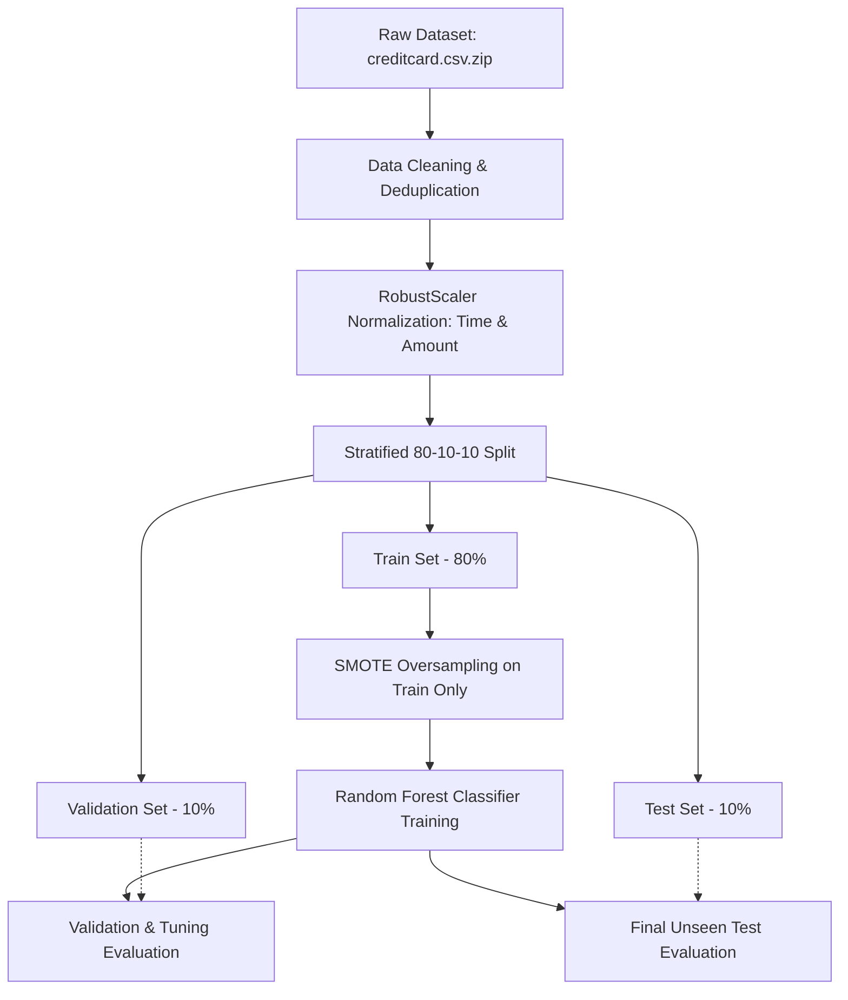

# Credit Card Fraud Detection

An end-to-end machine learning pipeline for detecting fraudulent credit card transactions using Random Forest and SMOTE oversampling.

---

## 📌 Project Overview

Credit card fraud represents a critical financial challenge characterized by extreme class imbalance (fraudulent transactions make up less than 0.2% of all activity). This project implements a robust, leak-free machine learning workflow:
- **Data Preprocessing & Cleaning**: Deduplication, missing value verification, and outlier-resistant normalization with `RobustScaler`.
- **Stratified Partitioning**: 80-10-10 split (Train, Validation, Test) to preserve rare class proportions.
- **Handling Imbalance**: Synthetic Minority Over-sampling Technique (**SMOTE**) applied exclusively to training data.
- **Classification**: **Random Forest** ensemble evaluated against both validation and test sets.

---

## 🚀 Pipeline Architecture



---

## 📊 Dataset & Splitting

- **Original Dataset**: Kaggle Credit Card Fraud Detection dataset (284,807 transactions, 31 features).
- **Features `V1`–`V28`**: PCA transformed components (confidentiality preserved).
- **Features `Time` & `Amount`**: Normalized using `RobustScaler` to eliminate sensitivity to extreme transaction amounts.
- **Duplicates Removed**: 1,081 duplicate transactions removed (283,726 unique rows).
- **Stratified Splits**:
  - **Train Set (80%)**: 226,980 samples
  - **Validation Set (10%)**: 28,373 samples (48 fraud cases)
  - **Test Set (10%)**: 28,373 samples (47 fraud cases)

---

## 📈 Model Performance & Evaluation

The final model was evaluated on the completely unseen **10% Test Set** (28,373 samples):

| Metric | Baseline Random Forest | SMOTE + Random Forest (Final) |
| :--- | :--- | :--- |
| **ROC-AUC Score** | 0.9348 | **0.9617** |
| **Fraud Recall (Class 1)** | 76.60% (36/47) | **78.72% (37/47)** |
| **Fraud Precision (Class 1)** | **97.30%** | **92.50%** |
| **Fraud F1-Score** | 0.8571 | **0.8506** |
| **False Alarms (Out of 28,326 Legit)** | **1** | **3** |
| **Overall Accuracy** | 99.96% | **99.95%** |

### Confusion Matrix (10% Test Set)

```text
               Predicted Legit    Predicted Fraud
Actual Legit        28,323               3  (False Positive)
Actual Fraud            10              37  (True Positive)
```

---

## 📁 Repository Structure

```text
├── creditcard.csv.zip          # Original compressed dataset
├── cleaned_creditcard.csv.zip  # Cleaned & scaled dataset (compressed)
├── main.py                     # Complete pipeline (cleaning, SMOTE, training, testing)
├── .gitignore                  # Git ignore rules for large uncompressed files
└── README.md                   # Project documentation
```

---

## 🛠️ Installation & Usage

### 1. Prerequisites
Ensure Python 3.9+ is installed. Install required packages:
```bash
pip install pandas scikit-learn imbalanced-learn
```

### 2. Run the Pipeline
Execute the main script:
```bash
python main.py
```

The script will automatically:
1. Load and clean the dataset.
2. Generate the normalized compressed dataset `cleaned_creditcard.csv.zip`.
3. Split the data into 80-10-10 partitions.
4. Train the Random Forest classifier with SMOTE on the training set.
5. Print performance reports on both the 10% Validation and 10% Test sets.
